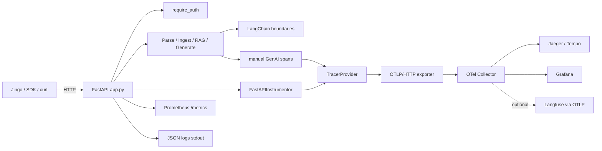

# docpipe Observability, Monitoring & API Gaps — Implementation Plan

**Date:** 2026-05-19  
**Status:** P0 implemented (2026-05-19); P1 partial; P2 deferred  
**Scope:** docpipe repo (`/Users/sunny/Desktop/Projects/docpipe`)  
**Related:** [2026-04-26-api-completeness.md](./2026-04-26-api-completeness.md) (shipped DELETE, history, stream, filters)

> **For agentic workers:** Use superpowers:subagent-driven-development or superpowers:executing-plans. Track progress with `- [ ]` checkboxes.

---

## 1. Executive summary

- **OTEL-first observability:** Instrument FastAPI with `opentelemetry-instrumentation-fastapi`, pipeline boundaries with manual spans using **GenAI semantic conventions** (`gen_ai.operation.name`, `gen_ai.provider.name`, `gen_ai.request.model`, `gen_ai.usage.*`), export via **OTLP/HTTP** (not vendor-locked SDKs as primary architecture).
- **Prometheus metrics:** Request latency histograms, ingest chunk counts, RAG duration, and **error counters labeled by `error_type`** from `docpipe_http_exception` (`configuration`, `upstream_provider`, `docpipe`).
- **Token usage in API responses:** Capture from LangChain `usage_metadata` / callback handlers at generation boundaries; add optional fields on `RAGQueryResponse` and a **non-breaking SSE metadata event** before `[DONE]` on `/rag/stream`.
- **Production health:** Extend `/health` with DB connectivity and optional lightweight embedding-provider probe; wire Docker env for OTLP endpoint, service name, and trace sampling.
- **Secondary tracks (P1/P2):** HTTP SDK parity (`incremental`, `output_model`, `source_contains` delete), multi-table RAG scope, docpipe-site playground, release checklist.

---

## 2. Goals & non-goals

### Goals

| Track | Goal |
|-------|------|
| **Observability (primary)** | End-to-end traces and metrics for ingest, parse, RAG, generate, delete; structured logs; OTLP export compatible with Grafana/Jaeger and optional Langfuse via collector |
| **Monitoring (primary)** | Prometheus scrape on `/metrics`; SLO-friendly histograms and error breakdown |
| **API surface (secondary)** | Close REST/SDK gaps vs CLI and `core/types.py` (`incremental`, `output_model`, flexible delete, multi-table queries) |
| **Integrator ergonomics** | Jingo and other callers get authoritative token counts from docpipe instead of client-side tiktoken estimates only |

### Non-goals

- Replacing Jingo’s Django-side LangSmith env wiring or duplicating `shared/llm_observability/` inside docpipe
- LangSmith or Langfuse as **primary** trace SDK (OTLP export only; Langfuse optional downstream)
- Legacy OpenTracing, StatsD-only metrics, manual trace-ID headers without OTEL context propagation
- Async job queue / background ingest (separate future plan)
- Full RAG evaluation UI in docpipe-server (P2 is defaults + site playground only)
- Changing Jingo’s `docpipe-unified_rag_chat_*.plan.md` files

---

## 3. P0 — Ship first

### 3.1 OpenTelemetry tracing

**Libraries (add to `[project.optional-dependencies]`):**

```toml
observability = [
    "opentelemetry-api>=1.27",
    "opentelemetry-sdk>=1.27",
    "opentelemetry-exporter-otlp-proto-http>=1.27",
    "opentelemetry-instrumentation-fastapi>=0.48b0",
    "opentelemetry-instrumentation-httpx>=0.48b0",  # optional: outbound provider calls
]
```

Include `observability` in `server` extra (or `all`).

**Settings (`DocpipeSettings` in `src/docpipe/config/settings.py`):**

| Env var | Default | Purpose |
|---------|---------|---------|
| `DOCPIPE_OTEL_ENABLED` | `false` | Master switch |
| `DOCPIPE_OTEL_SERVICE_NAME` | `docpipe` | `service.name` resource |
| `DOCPIPE_OTEL_EXPORTER_OTLP_ENDPOINT` | — | e.g. `http://otel-collector:4318/v1/traces` |
| `DOCPIPE_OTEL_EXPORTER_OTLP_HEADERS` | — | Optional auth (`key=value`, comma-separated) |
| `DOCPIPE_OTEL_TRACES_SAMPLER` | `parentbased_traceidratio` | SDK sampler name |
| `DOCPIPE_OTEL_TRACES_SAMPLER_ARG` | `1.0` | Sample ratio (0.0–1.0) |
| `OTEL_SEMCONV_STABILITY_OPT_IN` | `gen_ai_latest_experimental` | Opt into GenAI semconv v1.37+ (document in README) |

**Span naming (HTTP + pipeline):**

| Route / operation | Span name | Parent |
|-------------------|-----------|--------|
| `POST /parse` | `docpipe.parse` | FastAPI server span |
| `POST /ingest` | `docpipe.ingest` | FastAPI |
| `DELETE /ingest` | `docpipe.ingest.delete` | FastAPI |
| `POST /rag/query` | `docpipe.rag.query` | FastAPI |
| `POST /rag/stream` | `docpipe.rag.stream` | FastAPI |
| `POST /generate` | `docpipe.generate` | FastAPI |
| Inside RAG | `gen_ai.chat` (operation) | `docpipe.rag.*` |
| Embedding / retrieval child | `gen_ai.embeddings` / retrieval span | RAG span |

**GenAI attributes (align with [OTEL GenAI spans](https://opentelemetry.io/docs/specs/semconv/gen-ai/gen-ai-spans/) — use experimental opt-in):**

- `gen_ai.operation.name`: `chat`, `embeddings`, `retrieval` (as applicable)
- `gen_ai.provider.name`: `openai`, `google`, `anthropic`, etc.
- `gen_ai.request.model`: model id string
- `gen_ai.usage.input_tokens`, `gen_ai.usage.output_tokens` (when available)
- `docpipe.strategy`, `docpipe.table_name` (custom, namespaced)
- On errors: `exception.type`, `exception.message`; map `http_errors` `phase` → `docpipe.phase`

**Implementation tasks:**

- [ ] Create `src/docpipe/observability/__init__.py` — `configure_observability()`, `get_tracer()`, `shutdown_observability()`
- [ ] Create `src/docpipe/observability/tracing.py` — `TracerProvider`, `BatchSpanProcessor`, `OTLPSpanExporter`; idempotent configure (mirror Jingo `shared/llm_observability/tracing.py` pattern, but GenAI attributes)
- [ ] Create `src/docpipe/observability/spans.py` — `@contextmanager trace_operation(name, **attrs)` and helpers `set_gen_ai_usage(span, usage_dict)`
- [ ] Create `src/docpipe/observability/middleware.py` — optional: enrich FastAPI span with `docpipe.route`, `docpipe.error_type` on `HTTPException`
- [ ] Wire `FastAPIInstrumentor.instrument_app(app, excluded_urls="/health,/metrics")` in `create_app()` after app construction
- [ ] Call `configure_observability()` from `docpipe serve` entry (`src/docpipe/cli/main.py` or app factory lifespan)
- [ ] Wrap handlers in `app.py`: parse, ingest, delete, rag/query, rag/stream, generate with `trace_operation`
- [ ] In `src/docpipe/rag/pipeline.py`: child spans for retrieve + generate; read `response.usage_metadata` from LangChain `AIMessage` where present
- [ ] In `src/docpipe/ingestion/pipeline.py`: span around `aingest` with `docpipe.chunks_ingested`, `docpipe.incremental_skipped`

**Acceptance criteria (P0 tracing):**

- [ ] With `DOCPIPE_OTEL_ENABLED=true` and a local OTLP collector (Jaeger all-in-one or `otelcol`), a `POST /rag/query` produces a trace with server span + `docpipe.rag.query` + child LLM span
- [ ] Spans include `gen_ai.provider.name` and `gen_ai.request.model` when LLM is invoked
- [ ] `/health` and `/metrics` do not emit high-cardinality custom spans per scrape
- [ ] Disabling OTEL adds zero required deps at runtime (lazy import)

---

### 3.2 Prometheus metrics

**Library:** `prometheus-client>=0.20` + `prometheus-fastapi-instrumentator>=7.1.0` (2025-maintained; exposes `/metrics`).

**Custom metrics (`src/docpipe/observability/metrics.py`):**

| Metric | Type | Labels |
|--------|------|--------|
| `docpipe_http_request_duration_seconds` | Histogram | `method`, `handler`, `status` (via instrumentator defaults) |
| `docpipe_ingest_chunks_total` | Counter | `table_name` (bounded: validate identifier only) |
| `docpipe_rag_query_duration_seconds` | Histogram | `strategy`, `status` |
| `docpipe_errors_total` | Counter | `error_type`, `phase`, `handler` |

Increment `docpipe_errors_total` in a **single place**: extend `docpipe_http_exception()` or a FastAPI exception handler that reads `detail["error_type"]` and `detail["phase"]` from `http_errors.py`.

**Tasks:**

- [ ] Add `metrics.py` with metric definitions and `record_ingest(chunks)`, `record_rag(duration, strategy, ok)`, `record_error(error_type, phase, route)`
- [ ] In `create_app()`: `Instrumentator().instrument(app).expose(app, endpoint="/metrics", include_in_schema=False)`
- [ ] Exclude `/metrics` from auth (`src/docpipe/server/auth.py`) — same as `/health`
- [ ] Hook ingest/RAG handlers to record business metrics after success

**Acceptance criteria (P0 metrics):**

- [ ] `curl /metrics` returns `docpipe_rag_query_duration_seconds_bucket` after one RAG call
- [ ] Failed request with `upstream_provider` increments `docpipe_errors_total{error_type="upstream_provider",...}`
- [ ] Ingest response with `chunks_ingested=42` increments counter by 42

---

### 3.3 Structured logging

**Approach:** stdlib `logging` + **JSON formatter** (no bare `print`). Prefer lightweight `python-json-logger>=2.0` OR a 30-line `JsonFormatter` in `src/docpipe/observability/logging.py` to avoid heavy structlog migration unless needed later.

**Fields:** `timestamp`, `level`, `logger`, `message`, `trace_id`, `span_id` (from OTEL context when enabled), `request_id` (optional middleware UUID).

**Env:** `DOCPIPE_LOG_LEVEL` (existing), `DOCPIPE_LOG_FORMAT=json|text` (default `text` for local dev).

**Tasks:**

- [ ] Add `configure_logging(settings)` called at startup
- [ ] Replace `logger.exception`-only patterns where missing context on stream failures (`rag/stream` generator)
- [ ] Document log field schema in README observability section

**Acceptance criteria:**

- [ ] `DOCPIPE_LOG_FORMAT=json` emits one JSON object per line with `level` and `message`
- [ ] When OTEL enabled, logs include `trace_id` matching active span

---

### 3.4 Token usage in responses

**Types (`src/docpipe/core/types.py`):**

```python
class TokenUsage(BaseModel):
    input_tokens: int | None = None
    output_tokens: int | None = None
    total_tokens: int | None = None
```

Add to `RAGResult` and `RAGQueryResponse`:

- `usage: TokenUsage | None = None` (optional, default `None` — backward compatible)

**Capture (`src/docpipe/observability/tokens.py`):**

- [ ] `extract_usage_from_langchain_response(response) -> TokenUsage | None` — read `usage_metadata` on `AIMessage` / `LLMResult`
- [ ] `UsageCallbackHandler(BaseCallbackHandler)` — aggregate tokens across invoke/stream; attach to `RAGPipeline` via `config.callbacks` or per-call list
- [ ] Sum embedding tokens separately if provider returns them (optional P0.1)

**RAG pipeline (`rag/pipeline.py`):**

- [ ] `_generate` / `_generate_stream` return usage alongside answer
- [ ] `query()` / `aquery()` populate `RAGResult.usage`
- [ ] Set OTEL `gen_ai.usage.*` from same structure

**HTTP (`app.py`):**

- [ ] Map `result.usage` → `RAGQueryResponse.usage`

**Streaming contract (non-breaking):**

Current stream lines: `data: {token}\n\n` then `data: [DONE]\n\n`.

Add **before** `[DONE]`:

```
event: metadata
data: {"type":"usage","usage":{"input_tokens":123,"output_tokens":45,"total_tokens":168}}
```

- [ ] Jingo `DocpipeClient.rag_stream` already skips JSON lines that aren’t tokens; verify it ignores `event: metadata` or parses usage
- [ ] Document SSE format in README

**Acceptance criteria:**

- [ ] `POST /rag/query` JSON includes `"usage": {"input_tokens": N, ...}` when mock LLM returns `usage_metadata`
- [ ] Stream still delivers only token strings to clients that ignore events; clients opting in read `event: metadata`
- [ ] Existing tests in `tests/unit/test_rag_stream.py` pass unchanged

---

### 3.5 Health checks

**Extend `HealthResponse`:**

```python
class DependencyStatus(BaseModel):
    name: str
    status: Literal["ok", "degraded", "unavailable"]
    latency_ms: float | None = None
    detail: str | None = None

class HealthResponse(BaseModel):
    status: Literal["ok", "degraded", "unavailable"]
    version: str
    plugins: dict[str, list[str]]
    dependencies: list[DependencyStatus] = Field(default_factory=list)
```

**Checks:**

| Dependency | When | Logic |
|------------|------|-------|
| `database` | `DOCPIPE_HEALTH_CHECK_DB=true` (default true in Docker) | `SELECT 1` using `DOCPIPE_DB_CONNECTION_STRING` or skip if unset |
| `embedding_provider` | `DOCPIPE_HEALTH_CHECK_EMBEDDING=true` (default false) | Optional: embed `"health"` with configured provider/model + timeout 3s |

Overall `status`: `ok` if all required deps ok; `degraded` if optional embedding fails; `unavailable` if DB required and fails.

**Tasks:**

- [ ] Create `src/docpipe/server/health.py` with async/sync probes
- [ ] Update `/health` handler in `app.py`
- [ ] Keep **no auth** on `/health` for Docker `HEALTHCHECK`

**Acceptance criteria:**

- [ ] DB down → HTTP 503 or 200 with `"status": "unavailable"` (pick one, document; recommend **200 + body status** for orchestrators that only check HTTP)
- [ ] Docker compose healthcheck still passes when DB up

---

### 3.6 Docker & env templates

**Files:** `docker-compose.yml`, `docker-compose.full.yml`, `.env.example`, `README.md`

**Add to `.env.example`:**

```bash
# Observability (optional)
DOCPIPE_OTEL_ENABLED=false
DOCPIPE_OTEL_SERVICE_NAME=docpipe
DOCPIPE_OTEL_EXPORTER_OTLP_ENDPOINT=http://otel-collector:4318/v1/traces
DOCPIPE_OTEL_TRACES_SAMPLER_ARG=1.0
DOCPIPE_LOG_FORMAT=text
DOCPIPE_HEALTH_CHECK_DB=true
DOCPIPE_HEALTH_CHECK_EMBEDDING=false
```

**Compose snippet (optional profile `observability`):**

- [ ] Add `otel-collector` service (contrib image) receiving OTLP HTTP :4318
- [ ] Document Grafana/Jaeger/Langfuse paths:
  - **Jaeger:** all-in-one OTLP enabled
  - **Langfuse:** point collector exporter to `https://cloud.langfuse.com/api/public/otel` with Basic auth headers (optional backend, not primary)

**Acceptance criteria:**

- [ ] `docker compose up` with OTEL env sends traces to collector when enabled
- [ ] Default compose unchanged when OTEL vars omitted

---

## 4. P1 — HTTP SDK & REST gaps

**Gap analysis (verified 2026-05-19):**

| Feature | CLI / `core/types` | REST `app.py` | HTTP client |
|---------|-------------------|---------------|-------------|
| `incremental` ingest | ✅ `IngestionConfig` | ❌ `IngestRequest` missing | N/A |
| `output_model` RAG | ✅ `RAGConfig` | ❌ not serializable on REST | N/A |
| `source_contains` delete | Jingo uses SQL `LIKE` fallback | ❌ exact `source` only | `delete_by_source` workaround |
| Multi-table RAG | — | ❌ single `table_name` | per-library table in Jingo |

### 4.1 HTTP SDK module

**Package layout:**

```
src/docpipe/http/
  __init__.py      # export DocpipeClient
  client.py        # httpx sync + optional async
  models.py        # pydantic mirrors of REST bodies (or code-gen from OpenAPI later)
```

**Naming:** Prefer `docpipe.http` namespace (import `from docpipe.http import DocpipeClient`) over separate PyPI package `docpipe_sdk`.

**Tasks:**

- [ ] Implement `DocpipeClient(base_url, auth=(user, pass), timeout=...)`
- [ ] Methods: `health()`, `parse()`, `ingest()`, `delete_ingest()`, `search()`, `rag_query()`, `rag_stream()`, `generate()`, `evaluate()`
- [ ] Mirror Jingo `chat/docpipe/client.py` API shape for easy porting
- [ ] Add `[project.optional-dependencies] http = ["httpx>=0.27"]`
- [ ] Export in top-level `docpipe` only when httpx installed (lazy)

**Acceptance criteria:**

- [ ] `pip install "docpipe-sdk[http]"` + integration test against `TestClient` or mock transport
- [ ] README section “Python HTTP client” with parity table vs raw REST

### 4.2 REST: `incremental` + ingest metadata

- [ ] Add `incremental: bool = False` to `IngestRequest` in `app.py`
- [ ] Pass through to `IngestionConfig` in ingest handler
- [ ] Return `skipped` count in `IngestResponse` (field exists on `IngestionResult`; wire HTTP model)

### 4.3 REST: `output_model` (structured RAG)

REST cannot accept arbitrary Pydantic classes. Options (pick **A** for P1):

- **A)** `response_format: dict | None` — JSON Schema or `{"type":"object","properties":{...}}` passed to LangChain structured output
- **B)** Named registry of built-in schemas (heavier)

- [ ] Add `response_format` to `RAGQueryRequest` / `RAGConfig` serialization path
- [ ] Document limitation vs in-process SDK `output_model=MyModel`

### 4.4 DELETE: `source_contains`

- [ ] Extend `DeleteRequest` with `match_mode: Literal["exact", "contains"] = "exact"` and optional `source_contains: str` (mutually exclusive validation)
- [ ] SQL: `WHERE cmetadata->>'source' LIKE %s` with escaped pattern for contains mode
- [ ] Deprecate Jingo raw SQL fallback once shipped

### 4.5 Multi-table / document scope RAG

- [ ] Add `table_names: list[str] | None` to `RAGQueryRequest` (validated identifiers); when set, fan-out retrieve + merge by score (cap `top_k` per table or global)
- [ ] Alternative lighter scope: `source_filter: list[str]` applied via existing `filters` + `{"source": {"$in": ...}}` if LangChain PGVector supports — verify against `langchain-postgres` filter syntax first
- [ ] Document performance implications (N vector stores)

**Acceptance criteria (P1):**

- [ ] HTTP ingest with `incremental: true` skips unchanged source (unit test with mocked hash)
- [ ] DELETE with `match_mode=contains` removes MinIO path fragments without Jingo SQL
- [ ] `DocpipeClient` passes new fields

---

## 5. P2 — Evaluation defaults, site, release

### 5.1 Evaluation batch defaults

- [ ] `EvaluateRequest`: add `batch_size`, `max_concurrency` (default from `DocpipeSettings.max_concurrency`)
- [ ] `EvalPipeline`: respect concurrency limit; expose per-question timing in `EvalResult.metadata`
- [ ] Optional OTEL span per question: `docpipe.evaluate.question`

### 5.2 docpipe-site playground

Repo: `/Users/sunny/Desktop/Projects/docpipe-site`

- [ ] Playground: display `usage` on RAG query response
- [ ] Health panel: show `dependencies` from extended `/health`
- [ ] Form fields: `incremental`, `filters`, `history` (if not already)
- [ ] Link to observability env vars in deploy docs

### 5.3 Release checklist (docpipe)

Per `CLAUDE.md` release process, extend with:

- [ ] README: observability section (OTEL, Prometheus, SSE metadata, health)
- [ ] `.env.example` + compose OTEL profile
- [ ] `python run.py lint` + `python run.py test`
- [ ] Version bump (`pyproject.toml`, `_version.py`)
- [ ] `python run.py release <version>` → tag → `gh release create`
- [ ] Notify Jingo to bump docpipe image pin / dependency version

---

## 6. Architecture diagram



**OTEL-first note:** LangSmith is **not** in the hot path. Langfuse receives the same OTLP spans as Jaeger when configured on the collector exporter ([Langfuse OTEL docs](https://langfuse.com/docs/opentelemetry)).

---

## 7. Implementation phases & file paths

### Phase 0 — Scaffold (1 PR)

| File | Action |
|------|--------|
| `pyproject.toml` | Add `observability`, `http` extras |
| `src/docpipe/config/settings.py` | OTEL, log format, health flags |
| `src/docpipe/observability/__init__.py` | New |
| `src/docpipe/observability/tracing.py` | New |
| `src/docpipe/observability/metrics.py` | New |
| `src/docpipe/observability/logging.py` | New |
| `src/docpipe/observability/tokens.py` | New |
| `tests/unit/test_observability.py` | New |

### Phase 1 — Wire server (1 PR)

| File | Action |
|------|--------|
| `src/docpipe/server/app.py` | Instrument app, spans on routes, usage on RAG response, SSE metadata |
| `src/docpipe/server/auth.py` | Exclude `/metrics` |
| `src/docpipe/server/health.py` | New dependency checks |
| `src/docpipe/server/http_errors.py` | Optional: `record_error` hook |
| `src/docpipe/cli/main.py` | Call `configure_observability()` on `serve` |
| `tests/unit/test_api.py` | Health deps, metrics endpoint smoke |
| `tests/unit/test_rag_stream.py` | Metadata event |

### Phase 2 — Pipeline depth (1 PR)

| File | Action |
|------|--------|
| `src/docpipe/rag/pipeline.py` | Spans + usage callbacks |
| `src/docpipe/ingestion/pipeline.py` | Ingest spans + metrics |
| `src/docpipe/core/types.py` | `TokenUsage`, extend `RAGResult` |
| `tests/unit/test_rag.py` | Usage on mocked LLM |

### Phase 3 — P1 API + SDK (1–2 PRs)

| File | Action |
|------|--------|
| `src/docpipe/http/client.py` | New SDK |
| `src/docpipe/server/app.py` | incremental, delete contains, response_format |
| `src/docpipe/core/types.py` | Delete match_mode, multi-table config |
| `README.md` | API + SDK docs |

### Phase 4 — P2 + rollout (1 PR)

| File | Action |
|------|--------|
| `docker-compose.yml`, `.env.example` | OTEL profile |
| `docpipe-site` | Playground updates |
| `CHANGELOG.md` | Release notes |

---

## 8. Jingo integration notes (brief)

After docpipe ships P0 token fields:

| Area | Jingo change |
|------|----------------|
| `chat/docpipe/client.py` | Parse `usage` from `rag_query` JSON; parse `event: metadata` on stream; prefer server counts over `count_tokens(question)` for billing/logging |
| `shared/llm_observability/tracing.py` | Keep client-side `trace_llm_call` as outer span; optionally disable duplicate LLM spans or use `docpipe` spans as parent via trace context propagation (httpx OTEL instrumentation) |
| `shared/llm_observability/tokens.py` | Use docpipe `usage` when present; fallback to tiktoken |
| Settings | `DOCPIPE_*` unchanged; add optional `DOCPIPE_OTEL_*` on docpipe container in Jingo `docker-compose` only |
| Delete | Switch `delete_by_source` to `match_mode=contains` API when available |
| Health | Jingo readiness may call docpipe `/health` and surface `dependencies` in admin/status |

**Do not** copy Jingo’s LangSmith configuration into docpipe.

---

## 9. Testing strategy

### Unit tests

| Module | Tests |
|--------|-------|
| `tests/unit/test_observability.py` | `configure_observability` idempotent; tracer None when disabled |
| `tests/unit/test_metrics.py` | Counter/histogram increments via handler mocks |
| `tests/unit/test_api.py` | `/metrics` 200; error response increments `docpipe_errors_total` (use `prometheus_client.REGISTRY` sample check) |
| `tests/unit/test_health.py` | DB mock fail → degraded/unavailable body |
| `tests/unit/test_rag.py` | Mock LLM with `usage_metadata` → `RAGResult.usage` populated |
| `tests/unit/test_rag_stream.py` | Stream contains `event: metadata` before `[DONE]` |
| `tests/unit/test_http_client.py` | `DocpipeClient` against `TestClient` (P1) |

### Span name contract test

- [ ] Snapshot or assert span names in `trace_operation` calls match table in §3.1 (mock `Tracer` with `InMemorySpanExporter` from `opentelemetry-sdk`)

### Integration (optional CI job)

- [ ] Mark `@pytest.mark.requires_otel` — spin collector container, one RAG call, assert ≥1 span exported
- [ ] Existing `requires_rag` tests: assert `usage` key present when API key set

### Avoid

- Asserting on full OTLP protobuf payloads
- Vendor-specific Langfuse SDK tests in docpipe CI

---

## 10. Rollout

### Versioning

- [ ] **Minor bump** (e.g. `0.5.0`): new optional response fields, new endpoints/fields backward compatible
- [ ] Document SSE metadata as additive in CHANGELOG

### Image publish

- [ ] Merge to `main` → GitHub Actions builds `ghcr.io/thesunnysinha/docpipe:<version>`
- [ ] Update `docker-compose.yml` pinned tag in docpipe repo
- [ ] Jingo: bump docpipe service image tag in compose + run smoke `python run.py pytest chat/tests/test_docpipe_client.py`

### Env template updates

- [ ] `docpipe/.env.example` — OTEL + health + log format
- [ ] `jingo/env/backend/backend.env.example` — comment block pointing to docpipe OTEL vars (docpipe container only)

### Rollout order

1. Deploy docpipe with OTEL **disabled** (metrics + health only) — validate `/metrics` scrape
2. Enable OTEL at low sampling (`DOCPIPE_OTEL_TRACES_SAMPLER_ARG=0.1`)
3. Enable Jingo client parsing of `usage`
4. Ship P1 SDK; update Jingo to use `docpipe.http.DocpipeClient` optionally

### Verification commands

```bash
cd /Users/sunny/Desktop/Projects/docpipe
python run.py lint
python run.py test
DOCPIPE_OTEL_ENABLED=true DOCPIPE_OTEL_EXPORTER_OTLP_ENDPOINT=http://localhost:4318/v1/traces python run.py serve
curl -s localhost:8000/health | jq .
curl -s localhost:8000/metrics | head
```

---

## References (2025–2026)

- [OpenTelemetry FastAPI instrumentation](https://opentelemetry-python-contrib.readthedocs.io/en/latest/instrumentation/fastapi/fastapi.html) — `FastAPIInstrumentor`, `OTEL_PYTHON_FASTAPI_EXCLUDED_URLS`
- [GenAI semantic conventions](https://opentelemetry.io/docs/specs/semconv/gen-ai/gen-ai-spans/) — `gen_ai.*` attributes, `OTEL_SEMCONV_STABILITY_OPT_IN=gen_ai_latest_experimental`
- [prometheus-fastapi-instrumentator](https://github.com/trallnag/prometheus-fastapi-instrumentator) v7.1.0+
- [Langfuse OpenTelemetry](https://langfuse.com/docs/opentelemetry) — optional OTLP backend, not primary SDK
- Jingo patterns: `services/backend/shared/llm_observability/` (OTLP configure, `trace_llm_call`, token helpers)

---

## P0 task checklist (quick reference)

- [x] OTEL: `observability` package + FastAPI instrumentor + route/pipeline spans
- [x] Metrics: Prometheus instrumentator + `docpipe_*` business metrics + error_type labels
- [x] Logging: JSON structured logs with trace correlation
- [x] Tokens: `TokenUsage` on `RAGQueryResponse` + SSE `event: metadata`
- [x] Health: DB + optional embedding probe on `/health`
- [ ] Docker: OTLP env vars + optional collector profile (`.env.example` done; compose profile deferred)
- [x] Tests: metrics, spans, usage, health, stream metadata
- [x] README + `.env.example` observability section

### P1 (partial this pass)

- [x] REST `incremental` on ingest + `skipped` in response
- [x] REST `response_format` on RAG query
- [x] DELETE `match_mode=contains` / `source_contains`
- [x] Thin `docpipe.http.DocpipeClient` (health, ingest, delete, rag_query, rag_stream)
- [ ] Multi-table RAG (`table_names`) — deferred
- [ ] Full HTTP SDK parity (parse, search, generate, evaluate) — deferred
