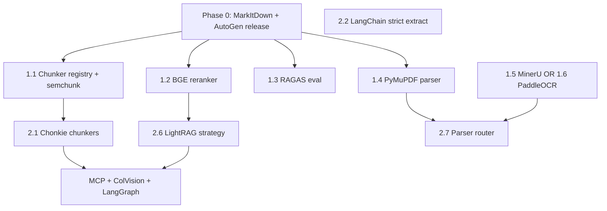

# docpipe Plugin Expansion — Full Implementation Plan

**Date:** 2026-06-12  
**Status:** Draft  
**Scope:** docpipe repo (`/Users/sunny/Desktop/Projects/docpipe`)  
**Related:** [2026-05-19-observability-and-api-gaps.md](./2026-05-19-observability-and-api-gaps.md)

> **For agentic workers:** Execute phase-by-phase. Each epic has file targets, API contract changes, tests, and release gates. Track with `- [ ]` checkboxes.

---

## 1. Executive summary

Expand docpipe from a **parser + extractor + ingest + RAG** SDK into a **pluggable document intelligence platform** with:

| Layer | Today | Target |
|-------|-------|--------|
| Parsers | docling, markitdown*, glm-ocr | + pymupdf, mineru, paddleocr, unstructured (optional) |
| Chunkers | LangChain recursive + domain presets | + semchunk, chonkie (semantic/late) |
| Rerankers | flashrank, cohere | + bge, mxbai |
| Extractors | langextract, langchain | + outlines (local); langchain uses native strict mode |
| Evaluators | Custom hit_rate / faithfulness prompts | + ragas, deepeval (CI) |
| RAG strategies | 6 vector strategies | + lightrag (graph) |
| Agents | autogen* | + langgraph; migrate path to MS Agent Framework |
| Observability | OTEL + Prometheus | + Phoenix eval hooks (optional) |

\*MarkItDown + AutoGen implemented locally (v0.5.5); **not yet committed/released**.

**2026 design principle:** No redundant structured-output wrappers. Default extract path = **LangChain + provider native strict JSON Schema**. Add Outlines only for self-hosted models.

---

## 2. Architecture — plugin registries

Extend the existing `PluginRegistry` pattern beyond parsers/extractors.

### 2.1 New registry groups

```
src/docpipe/registry/registry.py          # extend PluginRegistry
src/docpipe/core/chunker.py               # BaseChunker protocol
src/docpipe/core/reranker.py              # BaseReranker protocol
src/docpipe/core/evaluator.py             # BaseEvaluator protocol (optional)
```

Entry points in `pyproject.toml`:

```toml
[project.entry-points."docpipe.chunkers"]
recursive = "docpipe.chunkers.recursive_chunker:RecursiveChunker"
semchunk = "docpipe.chunkers.semchunk_chunker:SemchunkChunker"
chonkie-semantic = "docpipe.chunkers.chonkie_chunker:ChonkieSemanticChunker"
chonkie-late = "docpipe.chunkers.chonkie_chunker:ChonkieLateChunker"

[project.entry-points."docpipe.rerankers"]
flashrank = "docpipe.rerankers.flashrank_reranker:FlashRankReranker"
cohere = "docpipe.rerankers.cohere_reranker:CohereReranker"
bge = "docpipe.rerankers.bge_reranker:BGEReranker"
mxbai = "docpipe.rerankers.mxbai_reranker:MxbaiReranker"

[project.entry-points."docpipe.evaluators"]
builtin = "docpipe.eval.builtin_evaluator:BuiltinEvaluator"
ragas = "docpipe.eval.ragas_evaluator:RagasEvaluator"
```

### 2.2 Parser router (new, Phase 1b)

Auto-select parser by MIME/extension + quality tier:

```
src/docpipe/parsers/router.py
```

```python
# POST /parse { "source": "...", "parser": "auto", "tier": "fast|balanced|quality" }
TIER_MAP = {
    "fast": ["markitdown", "pymupdf"],
    "balanced": ["docling"],
    "quality": ["mineru", "paddleocr", "glm-ocr"],
}
```

### 2.3 Shared metadata on all plugins

Every plugin class exposes:

```python
name: str
license: str  # "MIT" | "Apache-2.0" | "AGPL-3.0" | "GPL-3.0"
requires_gpu: bool
supported_formats: list[str] | None

@classmethod
def is_available(cls) -> bool: ...
```

Surface in `GET /` and `GET /plugins` (new lightweight introspection route).

---

## 3. Phase 0 — Ship MarkItDown + AutoGen (v0.5.5)

**Goal:** Commit, test, release, redeploy common-services docpipe image.

### 3.1 Already implemented (verify)

- [ ] `src/docpipe/parsers/markitdown_parser.py`
- [ ] `src/docpipe/agents/{pipeline,tools,__init__}.py`
- [ ] `pyproject.toml` extras: `markitdown`, `autogen`
- [ ] `tests/unit/test_markitdown_parser.py`, `test_autogen_agents.py`
- [ ] README examples

### 3.2 Remaining Phase 0 tasks

- [ ] Add `POST /agents/query` route (optional but recommended for Jingo/Andocs HTTP clients)
  - `src/docpipe/schemas/agents.py`
  - `src/docpipe/server/app.py` — thin handler → `AgentRAGPipeline`
- [ ] Document `parser="markitdown"` on docpipe-site `lib/docs-content.ts`
- [ ] `python run.py lint && python run.py test`
- [ ] Bump tag `v0.5.5`, `gh release create`, CI docker push
- [ ] Redeploy `common-services` docpipe deployment

**Estimate:** 1–2 days

---

## 4. Phase 1 — Highest ROI plugins

### Epic 1.1 — Chunker plugin system + semchunk

**Problem:** Ingestion hard-codes LangChain `RecursiveCharacterTextSplitter` in `ingestion/pipeline.py`.

**Tasks:**

- [ ] Create `src/docpipe/core/chunker.py` — `BaseChunker` protocol:
  ```python
  def split_documents(self, docs: list[LCDocument]) -> list[LCDocument]: ...
  async def asplit_documents(...) -> ...
  ```
- [ ] Create `src/docpipe/chunkers/recursive_chunker.py` — move logic from `_create_splitter()`
- [ ] Create `src/docpipe/chunkers/semchunk_chunker.py` — wrap `semchunk.chunkerify()`
- [ ] Extend `IngestionConfig.chunk_method` → add `chunker: str = "recursive"` field
- [ ] Extend `IngestRequest` in `schemas/ingest.py` with `chunker: str = "recursive"`
- [ ] Register in `PluginRegistry` (new `_chunkers` dict + entry points)
- [ ] Unit tests: `tests/unit/test_semchunk_chunker.py`
- [ ] Integration test: ingest same doc with recursive vs semchunk, assert chunk count differs sensibly

**pyproject.toml:**

```toml
semchunk = ["semchunk>=4.0"]
```

**API example:**

```json
POST /ingest { "chunker": "semchunk", "chunk_size": 512, ... }
```

**Estimate:** 3–4 days

---

### Epic 1.2 — BGE + mxbai rerankers

**Problem:** `RAGPipeline._rerank()` is a growing if/elif chain (`flashrank`, `cohere` only).

**Tasks:**

- [ ] Create `src/docpipe/core/reranker.py` — protocol `rerank(query, chunks) -> list[RAGChunk]`
- [ ] Refactor existing flashrank/cohere into `src/docpipe/rerankers/`
- [ ] Add `src/docpipe/rerankers/bge_reranker.py` — `sentence_transformers.CrossEncoder("BAAI/bge-reranker-v2-m3")`
- [ ] Add `src/docpipe/rerankers/mxbai_reranker.py` — optional quality preset
- [ ] Extend `RAGConfig.reranker` Literal: `"none" | "flashrank" | "cohere" | "bge" | "mxbai"`
- [ ] Update `schemas/rag.py`, CLI `--reranker` choices, `request_mapping.py`
- [ ] Presets in docs: `fast=flashrank`, `quality=bge`
- [ ] Tests with mocked CrossEncoder

**pyproject.toml:**

```toml
rerank-quality = ["sentence-transformers>=3.0", "torch"]
# keep existing:
rerank = ["flashrank>=0.2"]
```

**Estimate:** 2–3 days

---

### Epic 1.3 — RAGAS evaluator integration

**Problem:** `EvalPipeline` uses hand-rolled LLM judge prompts; no industry-standard metrics.

**Tasks:**

- [ ] Create `src/docpipe/eval/ragas_evaluator.py`
- [ ] Extend `EvaluateRequest.metrics` to accept: `faithfulness`, `context_precision`, `context_recall`, `answer_relevancy` (RAGAS names)
- [ ] When `evaluator=ragas` (new field, default `builtin` for backward compat):
  - Build RAGAS dataset from questions + RAG results
  - Return metrics in `EvaluateResponse.metrics`
- [ ] Pin `ragas>=0.4.3` — migrate to v0.4 `@experiment()` API
- [ ] Tests: mock RAGAS `evaluate` / `Experiment`
- [ ] Document breaking note: RAGAS org moved to `vibrantlabsai`

**pyproject.toml:**

```toml
eval-ragas = ["ragas>=0.4.3"]
```

**API:**

```json
POST /evaluate/run {
  "evaluator": "ragas",
  "metrics": ["faithfulness", "context_precision", "context_recall"]
}
```

**Estimate:** 3–4 days

---

### Epic 1.4 — PyMuPDF4LLM parser

**Tasks:**

- [ ] `src/docpipe/parsers/pymupdf_parser.py` — mirror `markitdown_parser.py` pattern
- [ ] Entry point `pymupdf = "...PyMuPDFParser"`
- [ ] Register in `__init__._register_builtins()`
- [ ] Metadata: `license="AGPL-3.0"`, document commercial license path
- [ ] Tests with mocked `pymupdf4llm.to_markdown()`
- [ ] Add to parser router `tier=fast`

**pyproject.toml:**

```toml
pymupdf = ["pymupdf4llm>=0.3"]
```

**Estimate:** 1–2 days

---

### Epic 1.5 — MinerU parser (quality tier)

**Tasks:**

- [ ] `src/docpipe/parsers/mineru_parser.py`
  - Subprocess or Python API call to MinerU pipeline
  - Map output MD → `ParsedDocument`
  - `is_available()` checks GPU optional vs pipeline mode
- [ ] Heavy optional extra; **not** in `[all]` by default (Docker image size)
- [ ] Separate Docker target: `Dockerfile.mineru` or compose profile `docpipe-quality`
- [ ] K8s: optional second deployment `docpipe-quality` in common-services (GPU node pool) — **defer to Phase 2 infra** if no GPU on VPS
- [ ] Tests: mock MinerU output files

**pyproject.toml:**

```toml
mineru = ["mineru[all]>=3.3"]  # document GPU requirement
```

**Estimate:** 5–7 days (integration complexity)

---

### Epic 1.6 — PaddleOCR PP-Structure parser (alternative quality tier)

**Tasks:**

- [ ] `src/docpipe/parsers/paddleocr_parser.py`
- [ ] Lighter than MinerU for CPU/GPU hybrid; good APAC default
- [ ] Same `ParsedDocument` mapping pattern
- [ ] Tests with fixture JSON/MD output

**pyproject.toml:**

```toml
paddleocr = ["paddleocr[doc-parser]>=3.7"]
```

**Estimate:** 4–5 days

**Phase 1 release:** `v0.6.0` — chunkers + rerankers + RAGAS + pymupdf + one quality parser (MinerU **or** PaddleOCR first)

**Phase 1 total estimate:** 3–4 weeks

---

## 5. Phase 2 — Differentiation

### Epic 2.1 — Chonkie chunker facade

**Tasks:**

- [ ] `src/docpipe/chunkers/chonkie_chunker.py`
  - `ChonkieSemanticChunker`, `ChonkieLateChunker`
  - Requires embedding model config on `IngestionConfig` (reuse embedding_provider/model)
- [ ] `chunker=chonkie-semantic` | `chonkie-late`
- [ ] Benchmark helper script: `scripts/benchmark_chunkers.py` using MTCB nano split (optional dev dep)

**pyproject.toml:**

```toml
chonkie = ["chonkie[semantic,late]>=1.6"]
```

**Estimate:** 3–4 days

---

### Epic 2.2 — LangChain extractor → native strict mode

**No new library.** Harden existing path.

**Tasks:**

- [ ] Update `langchain_extractor.py` to pass `method="json_schema"` / `strict=True` per provider
- [ ] Add `ExtractionSchema.strict: bool = True` field
- [ ] Handle provider `refusal` field in response
- [ ] Tests per provider (mocked): openai, google, anthropic
- [ ] Document in README: "2026 default — no Instructor needed"

**Estimate:** 2 days

---

### Epic 2.3 — Outlines extractor (local models)

**Tasks:**

- [ ] `src/docpipe/extractors/outlines_extractor.py`
- [ ] Only for `ollama` / local vLLM backends
- [ ] Entry point `outlines = "...OutlinesExtractor"`

**pyproject.toml:**

```toml
outlines = ["outlines>=1.2"]
```

**Estimate:** 3–4 days

---

### Epic 2.4 — DeepEval CI integration

**Tasks:**

- [ ] `tests/eval/` — DeepEval test cases wrapping docpipe RAG
- [ ] GitHub Actions job `eval-regression` (nightly or on `main`)
- [ ] Not a runtime plugin — dev/CI dependency only
- [ ] `pyproject.toml` `dev` extra: `deepeval>=4.0`

**Estimate:** 2–3 days

---

### Epic 2.5 — Phoenix observability bridge

**Tasks:**

- [ ] `src/docpipe/observability/phoenix.py` — optional exporter config
- [ ] Settings: `DOCPIPE_PHOENIX_ENDPOINT`, `DOCPIPE_PHOENIX_PROJECT`
- [ ] Document docker-compose sidecar for Phoenix UI
- [ ] Wire eval spans to Phoenix when `evaluator=ragas`

**pyproject.toml:**

```toml
phoenix = ["arize-phoenix>=7.0"]
```

**Estimate:** 2–3 days

---

### Epic 2.6 — LightRAG strategy (#7)

**Tasks:**

- [ ] `src/docpipe/rag/strategies/lightrag.py`
- [ ] Extend `RAGConfig.strategy` Literal with `"lightrag"`
- [ ] New config fields: `graph_storage_uri`, `lightrag_working_dir` (or reuse connection_string pattern)
- [ ] Implement `LightRAGPipeline` wrapper — index on ingest hook (optional `graph_index: true` on IngestRequest)
- [ ] Tests with mocked LightRAG client

**pyproject.toml:**

```toml
lightrag = ["lightrag-hku>=1.5"]
```

**API:**

```json
POST /rag/query { "strategy": "lightrag", ... }
```

**Estimate:** 7–10 days

---

### Epic 2.7 — Parser router + `GET /plugins`

**Tasks:**

- [ ] `src/docpipe/parsers/router.py` — `resolve_parser(name, tier, mime) -> str`
- [ ] `GET /plugins` — list parsers/chunkers/rerankers/extractors with `available`, `license`, `formats`
- [ ] Homepage + docpipe-site update

**Estimate:** 2 days

**Phase 2 release:** `v0.7.0`

**Phase 2 total estimate:** 4–5 weeks

---

## 6. Phase 3 — Advanced / optional

### Epic 3.1 — Unstructured parser

- [ ] `src/docpipe/parsers/unstructured_parser.py` — partition → element-typed `ParsedDocument.pages`
- [ ] Use for format breadth; route hard PDFs to mineru via router
- **Estimate:** 4 days

### Epic 3.2 — ColQwen / ColPali visual retrieval

- [ ] New retrieval mode for layout-heavy PDFs (separate index type)
- [ ] Requires Qdrant or turbovec MaxSim support investigation
- [ ] `src/docpipe/retrieval/colvision.py`
- **Estimate:** 2–3 weeks (R&D heavy)

### Epic 3.3 — LangGraph agent backend

- [ ] `src/docpipe/agents/langgraph_pipeline.py` — parallel to `AgentRAGPipeline`
- [ ] Postgres checkpointing optional via caller-provided DSN
- [ ] `agent_backend: "autogen" | "langgraph"` on agent query request
- **Estimate:** 1–2 weeks

### Epic 3.4 — Microsoft Agent Framework migration

- [ ] `src/docpipe/agents/maf_pipeline.py`
- [ ] Deprecation notice on AutoGen plugin (maintenance mode upstream)
- **Estimate:** 1 week (after MAF Python SDK stabilizes)

### Epic 3.5 — Context-native embedding providers

- [ ] Extend `EMBEDDING_PROVIDERS` with `voyage` (`voyage-context-3`), `jina` (`late_chunking=True`)
- [ ] `embedding_mode: "standard" | "contextual" | "late_chunking"` on IngestionConfig
- **Estimate:** 3–5 days

### Epic 3.6 — MCP tool surface

- [ ] Expose docpipe stages as MCP tools: `parse_document`, `ingest_document`, `rag_query`, `extract_structured`
- [ ] `src/docpipe/mcp/server.py` — optional `docpipe-sdk[mcp]` extra
- [ ] Align with Haystack/LangGraph consuming MCP instead of bespoke HTTP
- **Estimate:** 1–2 weeks

**Phase 3 release:** `v0.8.0` + optional `v0.9.0` for ColVision

---

## 7. Cross-cutting work (every phase)

### 7.1 API & schemas

| Field | Endpoints | Phase |
|-------|-----------|-------|
| `chunker` | `/ingest` | 1 |
| `reranker=bge\|mxbai` | `/rag/query`, `/rag/stream` | 1 |
| `evaluator=ragas` | `/evaluate/run` | 1 |
| `parser=pymupdf\|mineru\|paddleocr` | `/parse`, `/ingest`, `/run` | 1 |
| `parser=auto`, `tier` | `/parse` | 2 |
| `strategy=lightrag` | `/rag/*` | 2 |
| `agent_backend` | `/agents/query` | 3 |
| `GET /plugins` | new | 2 |

### 7.2 HTTP client SDK (`src/docpipe/http/client.py`)

- [ ] Mirror every new request field in `DocpipeClient`
- [ ] Jingo `chat/docpipe/client.py` — follow after docpipe release

### 7.3 Docker & K8s

| Image | Contents | When |
|-------|----------|------|
| `docpipe:latest` | `[all]` without mineru/paddleocr GPU stacks | Always |
| `docpipe:slim` | server + docling + markitdown + pymupdf | Optional |
| `docpipe:quality` | + mineru or paddleocr | GPU nodes |

- [ ] Update `Dockerfile` multi-stage build
- [ ] `common-services` memory quota review (MinerU needs 4–8Gi+)
- [ ] CI: matrix build `slim` + `full`

### 7.4 Testing strategy

| Layer | Approach |
|-------|----------|
| Unit | Mock all heavy deps (every parser/chunker/reranker) |
| Contract | `tests/contract/` — OpenAPI snapshot for new fields |
| Integration | Mark `@pytest.mark.requires_mineru` etc. |
| Eval regression | DeepEval nightly on fixture corpus |
| Benchmark | Optional `scripts/benchmark_parsers.py` on OmniDocBench sample |

### 7.5 Documentation & release

Every release (per `CLAUDE.md`):

1. [ ] `README.md` + `CHANGELOG.md`
2. [ ] docpipe-site `lib/docs-content.ts`
3. [ ] `python run.py lint && python run.py test`
4. [ ] `python run.py release <version>`
5. [ ] GitHub Release → PyPI workflow
6. [ ] Redeploy common-services

### 7.6 License compliance matrix

Document in `docs/PLUGIN_LICENSES.md`:

| Plugin | License | Commercial use |
|--------|---------|----------------|
| docling, markitdown, mineru, paddleocr, bge | MIT/Apache | OK |
| pymupdf4llm | AGPL | Commercial license or OSS only |
| marker, surya | GPL-3 | Copyleft — avoid in default `[all]` |

---

## 8. Dependency graph



**Parallelizable after Phase 0:** Epics 1.1, 1.2, 1.3, 1.4 can run in parallel. MinerU/PaddleOCR are mutually independent but both touch Docker.

---

## 9. Consumer impact (Jingo, Andocs, Delegate)

| Consumer | Change needed |
|----------|---------------|
| **Jingo** | Bump docpipe client; optional `chunker=semchunk`, `reranker=bge`; no breaking changes if defaults unchanged |
| **Andocs** | Same; evaluate `parser=mineru` for PDF-heavy corpus |
| **Delegate** | Uses docpipe via common-services URL when assistant doc ingest lands |
| **common-services** | Redeploy on each docpipe release; GPU quota if quality image |

---

## 10. Timeline summary

| Phase | Version | Duration | Deliverables |
|-------|---------|----------|--------------|
| **0** | v0.5.5 | 1–2 days | MarkItDown, AutoGen, `/agents/query`, deploy |
| **1** | v0.6.0 | 3–4 weeks | semchunk, BGE rerank, RAGAS, pymupdf, quality parser |
| **2** | v0.7.0 | 4–5 weeks | Chonkie, strict extract, LightRAG, Outlines, Phoenix, router |
| **3** | v0.8.0+ | 6–8 weeks | Unstructured, LangGraph, MAF, context embeds, MCP, ColVision R&D |

**Total:** ~14–18 weeks for full roadmap (single developer, sequential). With 2 parallel workstreams: ~8–10 weeks.

---

## 11. Explicit non-goals

- **Instructor** as default extractor (use LangChain strict)
- **RAGatouille** (stale upstream)
- **RAPTOR** indexing (poor incremental story)
- **LlamaIndex/Haystack as core** (remain optional backends)
- **Full GraphRAG** in default image (indexing cost; LightRAG only)
- **Replacing pgvector** with Neo4j (unless customer-driven)

---

## 12. Phase 0 kickoff checklist (start here)

```bash
cd /Users/sunny/Desktop/Projects/docpipe
python run.py lint && python run.py test
# commit v0.5.5
# push + gh release + docker deploy common-services
```

Then open Phase 1 with Epic 1.1 (chunker registry) — it unblocks Chonkie in Phase 2 and is the highest-impact ingest change.
